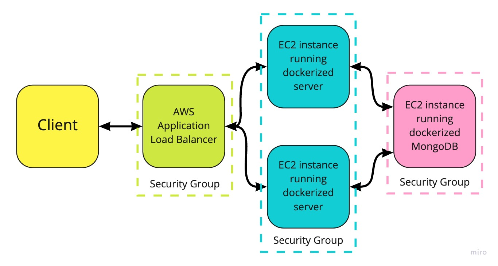

# Question & Answers API for <a href="https://github.com/DBdirtbags/threads">Threads</a>
This repository contains code for building the back-end services required for product Question/Answer data for Project Catwalk. Specifically, this repository will allow for the creation of Docker containers running Express servers as well as a MongoDB containing the Q&A data.

## Motivation
This project was implemented to allow for scaling on AWS as web traffic to the Threads site increases.

## Tech/framework used
<b>Built with:</b>
- Express
- MongoDB/Mongoose
- Docker
- AWS (EC2, Application load balancer)

## Features
- Handles upwards of 1000 requests/second with <1500 ms response time and 0% error rate
- Utilizes all free-tier AWS services

### AWS Setup

  

## Installation
Pre-requisites: Have MongoDB and Docker installed on your computer
1) After cloning the repo locally, `npm install`
2) Navigate to the docker-compose.yml file and adjust the volume mapping to a convenient location on your local machine for persistent data
3) Download data from <a href="https://drive.google.com/drive/folders/1vfzht2I5zikW0KW4Cfa5v92iYNaJ5D7w?usp=sharing">here</a> and place in the config folder in the main directory
3) From the main project directory, `docker-compose up --build`. The data will import into your MongoDB.
4) Once complete, you will be able to make requests to the API at localhost:3000 using the endpoints listed below.

## Routes
| Method/Route | Description | Usage
| ------- | ----------- | ---- |
| `GET /qa/questions` | Retrieves a list of questions for a particular product. | Query params: `product_id`, `count` (default = 5), `page` (default = 1) |
| `POST /qa/questions` | Adds a question for the given product | Body params: `product_id`, `body` (question text), `name` (asker name), `email` (asker email) |
| `PUT /qa/questions/:question_id/helpful` | Updates a question to show it was found helpful. | |
| `PUT /qa/questions/:question_id/report` | Reports a question. | |
| `GET /qa/questions/:question_id/answers` | Retrieves a list of answers for a given question. | Query params: `question_id`, `count` (default = 5), `page` (default = 1) |
| `POST /qa/questions/:question_id/answers` | Adds an answer to a question | Body params: `question_id`, `body` (answer text), `name` (answerer name), `email` (answerer email), `photos` (photos (urls)) |
| `PUT /qa/answers/:answer_id/helpful` | Updates an answer to show it was found helpful. | |
| `PUT /qa/answers/:answer_id/report` | Reports an answer. |  |

